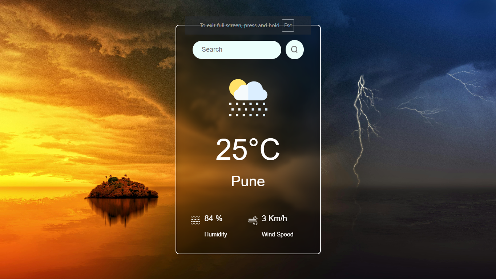

# 🌦️ Weather App

A responsive and dynamic weather forecast application built using React. It fetches real-time weather data based on the city name using the **OpenWeatherMap API**, and displays temperature, humidity, wind speed, and weather conditions with intuitive UI and icons.

---

## 🔍 Features

- Search weather by city name
- Auto-fetch weather for default city (Pune)
- Real-time data from OpenWeatherMap API
- Interactive UI with weather icons and unit formatting
- Loader spinner while fetching data
- Modal alert for empty or invalid inputs
- Clean and responsive design

---

## 🛠 Tech Stack

- **Frontend**: React.js, HTML, CSS
- **Styling**: Custom CSS
- **Icons/Assets**: PNG icons from `assets` folder
- **API**: OpenWeatherMap API
- **Build Tool**: Vite
- **Modal & UI**: React-Bootstrap

---

## 📁 Project Structure

```bash
weather-app/
├── node_modules/
├── public/
├── src/
│   ├── assets/
│   ├── components/
│   │   ├── Weather.jsx
│   │   └── Weather.css
│   ├── App.jsx
│   ├── App.css
│   ├── main.jsx
│   └── index.css
├── index.html
├── package.json
├── package-lock.json
├── README.md
└── vite.config.js
```

## 🖼️ Screenshot


## 🚀 Setup Instructions

1. **Clone the repository:**

   ```bash
   git clone https://github.com/<your-username>/<repo-name>.git
   cd <weather-app>
   ```

2. **Install Dependencies:**

   ```bash
   npm install
   ```

3. **Add your API Key:**

   ```bash
   VITE_APP_ID=your_openweather_api_key
   ```

3. **Start the Development Server:**

   ```bash
   npm run dev
   ```

#### [🚀 View Live Demo](https://weather-app-suyk.onrender.com)


   